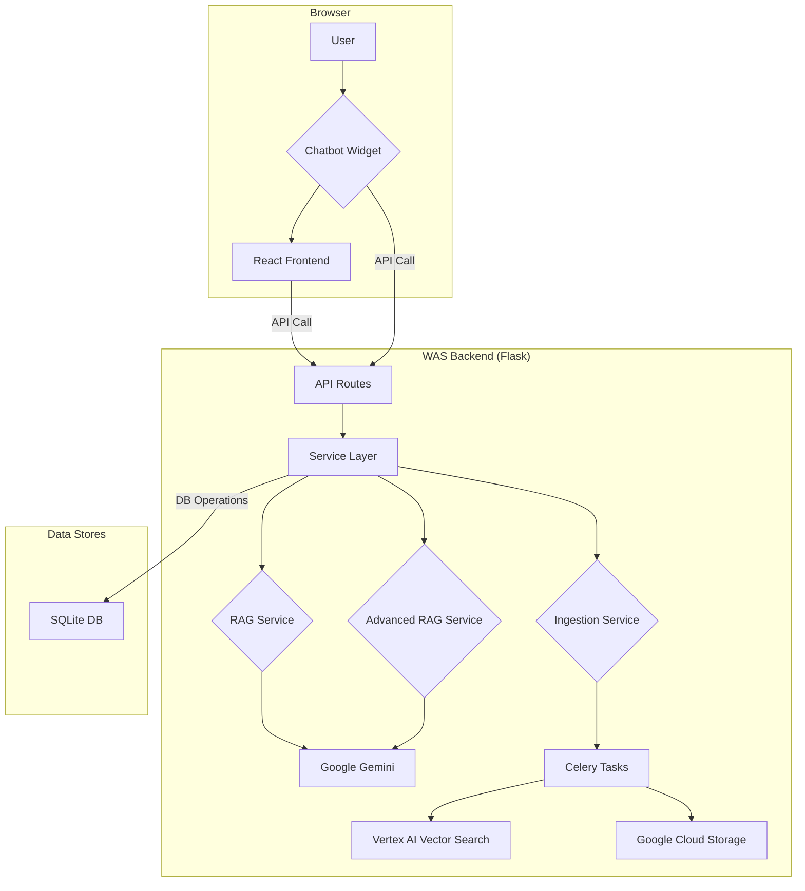
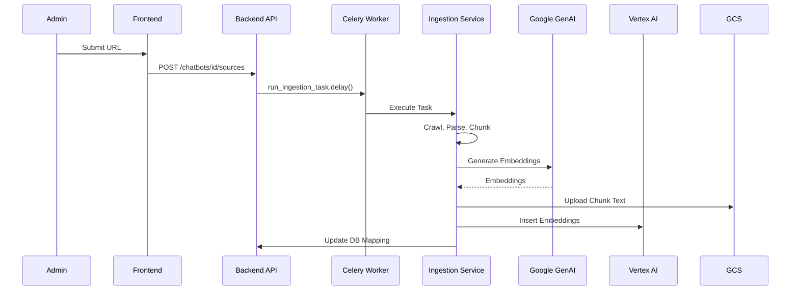
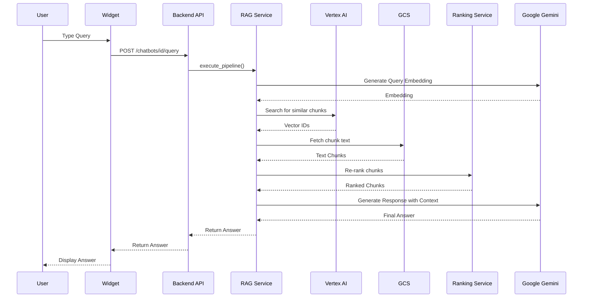
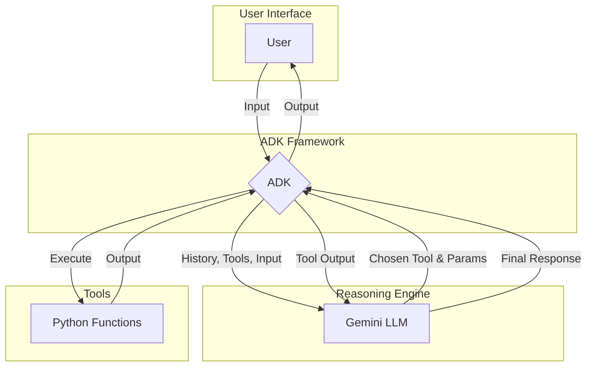

# Project Book: Website AI Assistance (WAS) & Agent Chatbot

## 1. Introduction

In the contemporary digital era, a company's website often serves as the primary point of interaction with its customers. The expectation for instant access to accurate information and seamless user experience has never been higher. However, as businesses grow, so does the volume and complexity of information on their websites, leading to a significant challenge: users often struggle to find the answers they need quickly and efficiently. Traditional search bars and static FAQ pages are frequently inadequate, leading to user frustration, high bounce rates, and an increased burden on customer support teams.

This gap between user expectation and reality presents a critical problem. Potential customers may abandon a purchase if they cannot resolve a query, and existing users may become dissatisfied if they cannot get the support they need. The conventional solution of scaling human support teams is costly, difficult to manage, and not available 24/7. There is a clear and pressing need for a more intelligent, scalable, and cost-effective way to manage user interaction and information delivery on websites.

To address this challenge, we have developed the **Website AI Assistance (WAS)** project. At its core, WAS is a sophisticated chatbot powered by Retrieval-Augmented Generation (RAG) technology. Unlike simple, scripted chatbots, WAS is designed to ingest and understand a vast and varied knowledge base—including website content, product documents, user manuals, and text files. It can then provide users with precise, contextually relevant answers in natural language. The system allows for a dynamic and intuitive conversational experience, enabling users to ask questions as if they were talking to a human expert and receive instant, accurate responses. This not only enhances user satisfaction but also empowers businesses to provide high-quality, automated support around the clock.

Complementing the informational capabilities of WAS is our second project: the **Agent Chatbot**. While WAS excels at retrieving and presenting information, the Agent Chatbot is designed to take action. It functions as a true digital assistant, capable of handling more complex, multi-step processes. For example, it can guide a user through a troubleshooting process, help them complete a purchase, or manage a booking. It is designed to be more interactive and task-oriented, effectively acting as an automated agent on behalf of the user or the business. By integrating agentic capabilities, we move beyond simple question-answering to create a system that can actively help users accomplish their goals, providing a more comprehensive and powerful solution for website interaction.

Together, the Website AI Assistance and the Agent Chatbot projects represent a holistic approach to revolutionizing the online user experience. They aim to transform websites from static information repositories into dynamic, interactive environments where users can not only find information effortlessly but also receive active assistance to achieve their objectives. This document will detail the journey of developing these two innovative systems, from their theoretical foundations to their implementation and future potential.

## 2. Theoretical Background

The development of the Website AI Assistance (WAS) and the Agent Chatbot is grounded in a modern, robust technology stack designed to deliver intelligent, scalable, and interactive user experiences. The architecture leverages a client-server model and integrates a suite of powerful libraries and cloud services, primarily centered around the Google Cloud Platform and open-source AI frameworks.

### 2.1 Core AI Concepts

At the heart of our projects are two transformative AI paradigms:

*   **Retrieval-Augmented Generation (RAG):** This is the foundational technology for the WAS chatbot. RAG is an advanced AI architecture that enhances the capabilities of Large Language Models (LLMs) by connecting them to external knowledge sources. Instead of relying solely on its pre-trained data, a RAG system first retrieves relevant information from a specific, up-to-date knowledge base (such as a company's website content, product manuals, or internal documents). This retrieved information is then provided to the LLM as context to generate a precise and informed answer. This approach significantly reduces the risk of the model generating incorrect or "hallucinated" information and ensures that the responses are always based on the provided source data.

*   **Agentic AI:** This concept powers our Agent Chatbot. An AI agent is a system that can perceive its environment, make decisions, and take actions to achieve specific goals. Unlike a simple chatbot that just answers questions, an agent can engage in multi-step tasks, use external tools (like APIs or databases), and maintain a memory of past interactions to inform its future actions. This allows for more complex and dynamic interactions, such as guiding a user through a checkout process, troubleshooting a technical issue, or making a reservation.

### 2.2 Technology Stack: Website AI Assistance (WAS)

The WAS project is built on a Python-based backend, utilizing a selection of powerful frameworks and libraries to create a robust and feature-rich conversational AI platform.

*   **Backend Framework:** The core of the application is built using **Flask**, a lightweight and flexible Python web framework. It provides the foundation for creating the API endpoints that the chatbot frontend communicates with.

*   **Database and Data Management:** We use **Flask-SQLAlchemy** as an Object-Relational Mapper (ORM), which allows us to interact with our relational database in an intuitive, Python-native way. **Flask-Migrate** is used to manage database schema migrations, ensuring that our database structure can evolve alongside the application's features.

*   **Artificial Intelligence and Machine Learning:** The AI capabilities are powered by **Google Cloud Vertex AI**, a comprehensive platform for building and deploying machine learning models.
    *   **Google Cloud Discovery Engine** is the cornerstone of our RAG implementation. It allows us to create a powerful search engine over our private data, enabling the chatbot to retrieve the most relevant information to answer user queries.
    *   **Google Generative AI** libraries provide access to Google's state-of-the-art Large Language Models (LLMs), which are used to generate the final, human-like responses.
    *   The text processing pipeline relies on a suite of specialized libraries: **LangChain** for structuring the RAG workflow, **Sentence-Transformers** for creating vector embeddings (numerical representations of text), and **rank_bm25** for efficient text ranking.

*   **Asynchronous Task Processing:** To handle time-consuming tasks like ingesting new documents or processing large amounts of data without blocking the main application, we use **Celery** with **Redis** as a message broker. This ensures the application remains responsive and can handle long-running background jobs efficiently.

*   **Voice Capabilities:** The chatbot supports voice interaction through the integration of **Google Cloud Speech-to-Text** for converting spoken user input into text, and **Google Cloud Text-to-Speech** for converting the chatbot's text responses back into natural-sounding audio.

### 2.3 Technology Stack: Agent Chatbot

The Agent Chatbot is designed for more complex, action-oriented tasks and utilizes a slightly different, more modern backend stack to support its real-time, interactive nature.

*   **Backend Framework:** The agent is built primarily on **FastAPI**, a modern, high-performance Python web framework. FastAPI is designed for building APIs quickly and efficiently, and its asynchronous nature is ideal for handling the real-time, streaming interactions required by an agentic system.

*   **Agent Development:** The core of the agent's logic is built using the **Google Agent Development Kit (ADK)**. This specialized framework provides the tools and structures needed to create sophisticated AI agents that can reason, plan, and use external tools to accomplish tasks.

*   **AI and E-commerce Integration:** Like the WAS project, the Agent Chatbot leverages **Google's Generative AI** models for its intelligence. Additionally, it integrates with **Google Cloud Retail**, which suggests capabilities related to interacting with product catalogs and e-commerce systems, allowing the agent to assist with tasks like product search and purchase.

## 3. Existing Situation

Before the development of the Website AI Assistance (WAS) and the Agent Chatbot, the digital landscape for customer interaction was largely defined by traditional, non-interactive, and often inefficient systems. Both users and businesses faced significant challenges that limited the effectiveness of a company's online presence.

### 3.1 The User's Perspective: A Fragmented and Frustrating Experience

For a typical user visiting a content-rich website, the journey to find specific information was often a frustrating one. The primary tools at their disposal were:

*   **Static FAQ Pages:** These pages, while well-intentioned, are inherently limited. They contain a predefined list of questions and answers, which may not cover the user's specific query. Users are forced to manually scan long lists of information, and if their question is not listed, the FAQ page offers no further help.

*   **Keyword-Based Search Bars:** Traditional website search functionality relies on simple keyword matching. This means that unless the user types the exact terminology used in the website's content, the search can easily fail to return relevant results. This system lacks any understanding of intent or context, often leading to a frustrating cycle of rephrasing search queries.

*   **Navigational Menus and Site Maps:** While essential for site structure, relying on complex menus to find specific pieces of information can be a cumbersome and time-consuming process, especially on large websites with hundreds of pages.

When these self-service tools failed, the user's only remaining option was to contact human support, typically through email, a contact form, or a phone call. This introduced a new set of problems:

*   **Delayed Responses:** Unlike an instant chat, email and contact forms result in significant delays, leaving the user waiting for hours or even days for a response.
*   **Limited Availability:** Human support teams are generally only available during standard business hours, leaving users without assistance during evenings, weekends, or holidays.

### 3.2 The Business's Perspective: High Costs and Missed Opportunities

From the business side, this situation was equally problematic, leading to operational inefficiencies and strategic disadvantages:

*   **High Support Costs:** A heavy reliance on human support agents is expensive. As a business grows, the cost of hiring, training, and managing a support team to handle a high volume of repetitive queries becomes a significant financial burden.

*   **Inefficient Resource Allocation:** Support agents were often bogged down answering the same basic questions repeatedly. This prevented them from focusing on more complex, high-value customer issues that require human expertise and problem-solving skills.

*   **Lost Sales and High Bounce Rates:** When potential customers cannot get the information they need about a product or service quickly, they are very likely to abandon the website and turn to a competitor. This friction in the user journey directly translates to lost revenue.

*   **Lack of Actionable Insights:** Traditional tools offered very little insight into what users were actually looking for. While website analytics could show page views and bounce rates, they could not reveal the specific, unanswered questions that users had. This made it difficult for businesses to identify and address gaps in their online content and documentation.

In summary, the existing situation was characterized by a significant disconnect between user needs and the tools available to meet them. The experience was inefficient for users and costly for businesses, creating a clear and compelling need for a more intelligent, responsive, and automated solution.

## 4. Characterization and Design

The design of the Website AI Assistance (WAS) and the Agent Chatbot is centered on a modern, decoupled architecture that separates the frontend user interface from the backend AI and business logic. This approach provides significant advantages in terms of scalability, maintainability, and the ability to develop and deploy different components of the system independently.

### 4.1 System Architecture: A Decoupled Approach

Our system employs a classic client-server architecture, but with a modern twist. The primary components are:

*   **Frontend (Client):** This is the user-facing component, which consists of a web-based chatbot widget that can be embedded on any website. The frontend is responsible for rendering the chat interface, capturing user input (text and voice), and displaying the responses generated by the backend. It is built using modern web technologies to ensure a responsive and engaging user experience.

*   **Backend (Server):** This is the brain of the operation. The backend is a collection of services responsible for processing user requests, managing the knowledge base, interfacing with the AI models, and handling all the core business logic. We have two distinct backend systems: one for the WAS RAG chatbot and one for the Agent Chatbot, each tailored to its specific tasks.

*   **Communication:** The frontend and backend communicate via a secure, stateless API (Application Programming Interface). The frontend sends user queries to the backend, and the backend returns the generated responses. This decoupled design means that the frontend does not need to know anything about the complex AI processing happening on the server, and the backend can be updated or scaled without affecting the user interface.

### 4.2 Design of the Website AI Assistance (WAS)

The WAS system is designed to be a highly efficient and accurate information retrieval system. Its key design features include:

*   **Modular Ingestion Pipeline:** The system is designed to ingest information from a variety of sources, including crawling website URLs, and uploading documents (`.pdf`, `.docx`), and raw text. Each data source is processed through a dedicated pipeline that extracts the text content, cleans it, and divides it into manageable chunks for indexing.

*   **Vector-Based Retrieval:** At the core of the RAG implementation is a powerful search and retrieval system built on Google's Discovery Engine. When a user asks a question, the system converts the query into a vector embedding and uses it to find the most semantically similar text chunks from the indexed knowledge base.

*   **Generative Response Model:** The retrieved text chunks are then passed to a Google Generative AI model, which uses this context to synthesize a coherent, natural-language answer. This ensures that the response is not just a snippet of a document but a helpful and contextually appropriate answer.

*   **Scalable and Asynchronous Processing:** The use of Celery and Redis allows the system to handle data ingestion and other long-running tasks in the background, ensuring that the user-facing API remains fast and responsive at all times.

### 4.3 Design of the Agent Chatbot

The Agent Chatbot is designed for more interactive and task-oriented conversations. Its design emphasizes flexibility and the ability to take action:

*   **Stateful Conversation Management:** Unlike the largely stateless WAS chatbot, the Agent Chatbot is designed to maintain a memory of the conversation, allowing it to handle multi-turn dialogues and complex, sequential tasks.

*   **Tool-Using Capability:** The agent is built using the Google Agent Development Kit (ADK), which allows it to use external "tools." These tools can be anything from a database query to an API call to another service. This enables the agent to perform actions like checking the status of an order, booking an appointment, or interacting with an e-commerce platform.

*   **Real-Time, Streaming API:** The agent's backend is built on FastAPI, which is ideal for handling the streaming, real-time communication required for a truly interactive agent. This allows for a more dynamic and natural conversational flow.

### 4.4 Development Tools and Environment

The entire project is developed using a suite of industry-standard tools that promote collaboration, code quality, and efficient development:

*   **Programming Language:** The backend for both projects is written in **Python**, chosen for its extensive ecosystem of AI and machine learning libraries and its robust web frameworks.
*   **Web Frameworks:** **Flask** is used for the WAS backend, while **FastAPI** is used for the Agent Chatbot, allowing us to use the best tool for each specific job.
*   **Frontend Technologies:** The user-facing components are built with standard web technologies: **HTML**, **CSS**, and **JavaScript**, with **React** being used for the main chatbot management interface to create a modern, dynamic user experience.
*   **Version Control:** All source code is managed using **Git**, with **GitHub** serving as the central repository for collaboration and version history.
*   **Cloud Platform:** The entire system is designed to be deployed on the **Google Cloud Platform (GCP)**, leveraging its powerful, scalable services for AI, data storage, and computing.

## 5. Scenarios

This section illustrates the practical applications of the Website AI Assistance (WAS) and the Agent Chatbot through a series of user stories and system process descriptions. These scenarios demonstrate how the chatbots address the real-world needs of both end-users and the businesses that deploy them.

### 5.1 User Stories

User stories are short, simple descriptions of a feature told from the perspective of the person who desires the new capability, usually a user or customer of the system.

#### 5.1.1 Website AI Assistance (WAS) User Stories

*   **As a potential customer,** I want to ask the chatbot specific questions about a product's features and compatibility, so that I can make an informed purchasing decision without having to read through long product descriptions.

*   **As a new user of a software product,** I want to ask the chatbot how to perform a specific task (e.g., "How do I reset my password?"), so that I can get immediate help without having to search through documentation or wait for a support agent.

*   **As a business owner,** I want to upload our company's policy documents and FAQs into the chatbot's knowledge base, so that it can provide consistent and accurate answers to common customer questions, reducing the workload on my support team.

*   **As a support manager,** I want to see the questions that users are asking the chatbot, so that I can identify gaps in our knowledge base and improve our documentation.

#### 5.1.2 Agent Chatbot User Stories

*   **As a customer trying to buy a product,** I want the chatbot to guide me through the checkout process, helping me select shipping options and apply a discount code, so that I can complete my purchase smoothly.

*   **As a user facing a technical issue,** I want the agent to walk me through a series of troubleshooting steps, asking me questions and providing instructions based on my answers, so that I can resolve the problem myself.

*   **As a traveler,** I want to tell the agent my destination and dates, and have it find and book a suitable hotel for me, handling the entire reservation process.

### 5.2 System Processes

These descriptions outline how the system responds to user requests in specific scenarios.

#### 5.2.1 System Process: Answering a Question with WAS

1.  **User Input:** A user opens the chatbot widget on a website and types a question: "What is your return policy?"
2.  **API Request:** The frontend sends the user's question to the WAS backend via an API call.
3.  **Information Retrieval (RAG):**
    *   The backend receives the request and sends the user's query to the Google Discovery Engine.
    *   The Discovery Engine searches its indexed knowledge base (which contains the company's return policy document) and retrieves the most relevant text chunks related to "return policy."
4.  **Response Generation:**
    *   The retrieved text chunks and the original user question are passed to a Google Generative AI model.
    *   The model uses the provided context to generate a clear and concise answer, such as: "Our return policy allows you to return any item within 30 days of purchase for a full refund. The item must be in its original condition and packaging."
5.  **API Response:** The backend sends the generated answer back to the frontend.
6.  **Display to User:** The frontend displays the chatbot's answer in the chat window.

#### 5.2.2 System Process: Booking a Hotel with the Agent Chatbot

1.  **User Input:** A user interacts with the Agent Chatbot and says, "I need to book a hotel in New York from October 10th to 12th."
2.  **Intent Recognition and Slot Filling:** The agent recognizes the user's intent ("book hotel") and identifies the key pieces of information (entities): destination ("New York"), check-in date ("October 10th"), and check-out date ("October 12th").
3.  **Tool Use: Hotel Search:**
    *   The agent determines that it needs to use its "hotel search" tool.
    *   It calls an external hotel booking API, passing the destination and dates as parameters.
4.  **Presenting Options:**
    *   The booking API returns a list of available hotels.
    *   The agent formats this information and presents a few options to the user: "I've found a few options for you. The Grand Hyatt is $300 per night, and the Marriott Marquis is $350 per night. Which one would you like?"
5.  **User Selection and Confirmation:**
    *   The user replies, "The Grand Hyatt, please."
    *   The agent confirms: "Okay, I will book the Grand Hyatt for you from October 10th to 12th. Should I proceed?"
6.  **Tool Use: Booking Confirmation:**
    *   The user confirms, and the agent calls the booking API again, this time with the instruction to finalize the reservation for the Grand Hyatt.
7.  **Final Response:** The agent receives a confirmation number from the API and presents it to the user: "Your booking is confirmed! Your confirmation number is XYZ123."

## 6. The Implementation

This section details the practical implementation of the projects, focusing on the software architecture, the roles of the main components, the flow of key algorithms, and the structure of the database.

### 6.1 Website AI Assistant (WAS) Implementation

The WAS platform is implemented as a three-tier application, with a clear separation between the backend, frontend, and the embeddable widget.

#### 6.1.1 Architecture and Main Components

The system's architecture is realized through three distinct but interconnected codebases:

*   **Backend (`chatbot-backend`):**
    *   **Core Application:** Built using the **Flask** web framework. The main application is initialized in `app/__init__.py`, where extensions like the database (Flask-SQLAlchemy) and login manager are configured.
    *   **API Endpoints (`app/api/routes.py`):** This file defines all the HTTP endpoints that the frontend and widget communicate with. It handles request validation, authentication, and orchestrates calls to the service layer. Key endpoints include `/chatbots` for creation and listing, `/chatbots/<id>` for management, and `/chatbots/<id>/query` for the core RAG functionality.
    *   **Service Layer (`app/services/`):** This is where the core business logic resides.
        *   `rag_service.py`: The heart of the application. The `RagService` class manages the entire RAG pipeline, including initializing clients for Google Cloud services, generating embeddings, retrieving chunks from the vector index, constructing prompts, and generating the final response from the LLM.
        *   `ingestion_service.py`: Handles the logic for processing data sources. It contains functions for crawling websites and parsing different file types (PDF, DOCX).
        *   `advanced_rag_service.py`: Implements the optional, more complex RAG pipeline, including steps for query decomposition and re-ranking.
    *   **Asynchronous Tasks (`app/tasks/`):** To avoid blocking the API with long-running operations, the system uses **Celery**.
        *   `ingestion_tasks.py`: Contains the Celery task that performs the actual data ingestion and embedding process in the background.
        *   `deletion_tasks.py`: Contains Celery tasks for asynchronously deleting chatbot data from the vector index and database.
    *   **Database Models (`app/models.py`):** Defines the application's database schema using SQLAlchemy's ORM.

*   **Frontend (`chatbot-frontend`):**
    *   **Core Application:** A **React** Single-Page Application (SPA), with `src/main.jsx` as the entry point.
    *   **Routing:** `react-router-dom` is used to manage navigation between different pages (e.g., Login, Dashboard, Edit Chatbot).
    *   **Components (`src/components/`):** The UI is built from a collection of reusable React components, such as forms for adding data sources (`AddUrlForm.jsx`) and settings for widget customization (`WidgetCustomizationSettings.jsx`).
    *   **Pages (`src/pages/`):** These components represent the main views of the application, such as `DashboardPage.jsx` and `EditChatbotPage.jsx`.
    *   **API Communication (`src/services/api.js`):** An Axios-based service that centralizes all HTTP requests to the backend API.

*   **Widget (`chatbot-widget`):**
    *   **Core Logic (`src/index.js`):** The main entry point for the widget. It handles initialization, reads configuration from the `data-` attributes on the script tag, and sets up event listeners.
    *   **UI Management (`src/ui.js`):** Contains the functions responsible for creating, showing, hiding, and updating the HTML elements of the chat widget.
    *   **State Management (`src/state.js`):** A simple, custom state management module to hold the conversation history and UI state.
    *   **Event Handling (`src/handlers.js`):** Manages user interactions, such as sending a message, clicking the voice input button, or canceling a request.

#### 6.1.2 Core Algorithms and Data Flow

*   **Data Ingestion and Indexing:**
    1.  An administrator submits a new data source (e.g., a URL) via the frontend dashboard.
    2.  The request hits the `/chatbots/<id>/sources` endpoint in `routes.py`.
    3.  The route validates the request and queues an asynchronous task by calling `run_ingestion_task.delay()`.
    4.  A Celery worker picks up the task and executes the logic in `ingestion_service.py`.
    5.  The service crawls the URL or parses the file, extracts the text, and splits it into chunks.
    6.  For each chunk, it generates a vector embedding using the Google GenAI API.
    7.  The chunk text is uploaded to Google Cloud Storage, and the vector embedding is inserted into the Vertex AI Vector Search index, namespaced by the `chatbot_id`.
    8.  A mapping between the vector ID and the source identifier is saved in the `VectorIdMapping` table in the database.

*   **RAG Query Processing:**
    1.  An end-user types a query into the widget.
    2.  The widget's `handlers.js` sends the query to the `/chatbots/<id>/query` endpoint, including the chatbot's API key.
    3.  The `@require_api_key` decorator in `routes.py` validates the key.
    4.  The route calls the `execute_pipeline` method in the `RagService`.
    5.  The service generates an embedding for the user's query.
    6.  It calls the `retrieve_chunks_multi_query` method, which queries the Vertex AI Vector Search index, filtering by the `chatbot_id` namespace to find the most relevant vector IDs.
    7.  The service then fetches the corresponding text for these vector IDs from Google Cloud Storage using the `fetch_chunk_texts` method.
    8.  The retrieved texts are passed to the `RankingService` to be re-ranked for relevance.
    9.  The service constructs a detailed prompt containing the user's query and the re-ranked context, using the `construct_prompt` method.
    10. This final prompt is sent to the Google Gemini model via the `generate_response` method.
    11. The generated answer is returned through the API to the widget, which then displays it to the user.

#### 6.1.3 Database Implementation

The application's data is stored in a **SQLite** database, managed by **Flask-SQLAlchemy**. The schema, defined in `app/models.py`, consists of several key tables:

*   **`User`:** Stores information about the administrators, including their email, a unique `client_id`, and authentication details. Each user can own multiple chatbots.
*   **`Chatbot`:** The central table, containing the configuration for each chatbot. This includes its name, owner (`user_id`), status, and a wide range of customization settings for the widget's appearance and features (e.g., `widget_primary_color`, `voice_enabled`, `advanced_rag_enabled`).
*   **`VectorIdMapping`:** A crucial table for the RAG process. It creates a link between a `chatbot_id`, a `vector_id` in the Vertex AI index, and the `source_identifier` (e.g., the URL or filename) where the original text came from.
*   **`ChatMessage`:** Stores the history of conversations for each chatbot, linked by a `session_id`. Each row represents a single message from either the 'user' or the 'assistant'.
*   **`Plan`, `Subscription`, `PaymentHistory`, `UsageLog`:** A set of tables designed to support a subscription-based service model, tracking different plans, user subscriptions, payments, and usage.

### 6.2 Agentic Chatbot Implementation

The agentic chatbot is not a standalone application in the same way as WAS, but rather a proof-of-concept implemented within the **Google Agent Development Kit (ADK)** framework.

*   **Main Components:**
    *   **Agent Definition (`customer_service/`):** The core logic is defined within this directory. The agent's capabilities are determined by the set of "tools" it is given.
    *   **Tools (`customer_service/tools/tools.py`):** This file (inferred location) contains the Python functions that the agent can call. In this implementation, these are **mocked functions** that simulate interactions with external systems. For example, the `modify_cart` function does not connect to a real e-commerce backend; it simply returns a success message to demonstrate the agent's reasoning capability.
*   **Algorithm:**
    1.  The user provides input via the ADK's command-line or web interface.
    2.  The ADK framework sends the user's input, the conversation history, and the list of available tools to the Gemini LLM.
    3.  The LLM acts as a reasoning engine. It analyzes the user's intent and determines if one of the tools can help fulfill the request.
    4.  If it chooses a tool, it also extracts the necessary parameters from the conversation.
    5.  The ADK executes the chosen Python function with the extracted parameters.
    6.  The return value of the function (the "tool output") is sent back to the LLM.
    7.  The LLM then uses the tool's output to generate a natural language response for the user.
*   **Database:** This project uses a simple **SQLite** database (`ecommerce.db`) for the mocked product catalog, but it is not integrated into the agent's core logic in the same way as the WAS platform's database. The agent's interaction with it is simulated through the tool functions.

## 7. Technical Details

This section delves into the specific machine learning and data processing techniques that are central to the functionality of the Website AI Assistance (WAS) and the Agent Chatbot.

### 7.1 Data and Features

The raw data for our system is the unstructured text that constitutes the knowledge base. This can come from a variety of sources, such as websites, PDF documents, or Word files. The core challenge is to transform this unstructured data into a format that our machine learning models can understand and use.

*   **Text as a Feature:** The primary feature we work with is the text itself. However, raw text is not directly usable by most algorithms. The key process is to convert this text into numerical representations.

*   **Vector Embeddings:** We use advanced **sentence-transformer** models to convert our text chunks into high-dimensional vectors, or "embeddings." Each vector represents the semantic meaning of the text chunk. This is the most critical feature we use, as it allows us to perform a semantic search. Instead of just matching keywords, we can find text chunks that are conceptually similar to the user's query, even if they don't use the exact same words.

### 7.2 Algorithms

Our system employs a combination of algorithms for different parts of the RAG pipeline.

*   **Text Splitting Algorithms:** The first step in processing our data is to split large documents into smaller chunks. We use algorithms from `langchain-text-splitters` that are designed to do this intelligently. For example, a **Recursive Character Text Splitter** will try to split text based on a hierarchy of separators (like newlines, sentences, or spaces) to keep related pieces of text together as much as possible.

*   **Retrieval Algorithms:**
    *   **Dense Retrieval (Vector Search):** This is our primary retrieval method. It works by calculating the "distance" (e.g., using cosine similarity) between the user's query vector and the vectors of all the text chunks in our knowledge base. The chunks with the smallest distance (i.e., the most similar vectors) are returned. This is handled efficiently by Google's Discovery Engine.
    *   **Sparse Retrieval (BM25):** As a secondary or hybrid approach, we use the **BM25** algorithm. This is a sophisticated keyword-based search algorithm that ranks documents based on the frequency and importance of the words in the user's query. It excels at finding documents with exact keyword matches and can be a powerful complement to vector search.

*   **Generative Algorithms (LLMs):** The final step of the process uses a Large Language Model (LLM) from Google's Generative AI suite. These are transformer-based neural networks that have been trained on a massive amount of text data. They are capable of understanding the context provided by our retrieval step and generating fluent, coherent, and contextually relevant text as a final answer.

### 7.3 The Learning and Generation Process

It is important to note that, in the context of our RAG system, we are not "training" the LLM itself. The LLM is a pre-trained model. Instead, our "learning" process is focused on building and maintaining the knowledge base that the LLM uses.

The end-to-end process for answering a question looks like this:

1.  **Offline Process: Indexing the Knowledge Base**
    *   A new data source (e.g., a PDF) is provided to the system.
    *   The text is extracted and cleaned.
    *   The text is split into manageable chunks.
    *   Each chunk is passed through a sentence-transformer model to create a vector embedding.
    *   The text chunk and its corresponding vector embedding are stored and indexed in the Google Discovery Engine. This process is repeated for all data sources.

2.  **Online Process: Answering a User Query**
    *   A user asks a question.
    *   The user's question is converted into a vector embedding using the same sentence-transformer model.
    *   This query vector is used to search the indexed knowledge base for the most similar text chunk vectors (the retrieval step).
    *   The original text of these top-ranked chunks is retrieved.
    *   A prompt is constructed that includes the user's original question and the retrieved text chunks.
    *   This prompt is sent to the pre-trained LLM.
    *   The LLM reads the prompt and, using the provided context, generates a new, original answer to the user's question (the generation step).

This two-step process of retrieval and generation allows us to combine the vast world knowledge of a pre-trained LLM with the specific, up-to-date information from our private knowledge base, resulting in a highly accurate and trustworthy conversational AI system.