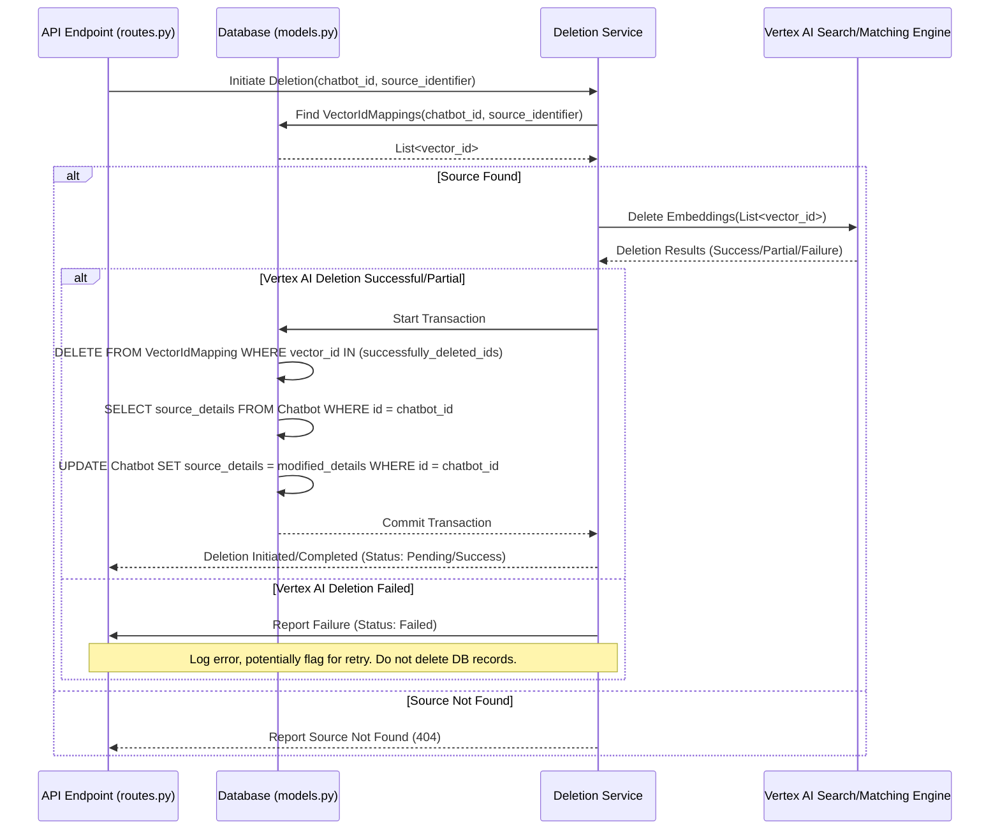

# Technical Plan: Selective Source Data Deletion for Chatbot

**Version:** 1.0
**Date:** 2025-04-15

## 1. Introduction

This document outlines the technical implementation plan for adding functionality to selectively delete specific data sources (identified by URL or filename) from the chatbot system. The deletion process must ensure the complete removal of associated records from the primary database and the corresponding vector embeddings from the Vertex AI Search/Matching Engine index, maintaining data integrity throughout.

## 2. Goals

*   Enable administrators or chatbot owners to trigger the deletion of a specific data source (URL or file) associated with a chatbot.
*   Reliably identify all database records and Vertex AI vector embeddings linked to the specified source.
*   Perform a clean and complete removal of identified data from both the database and Vertex AI.
*   Ensure system consistency between the database and the Vertex AI index.
*   Implement safeguards against accidental deletion and unauthorized access.
*   Provide comprehensive logging for auditing and troubleshooting.

## 3. Analysis of Existing System

*   **Database:** Uses SQLAlchemy with models defined in `app/models.py`. Key models:
    *   `Chatbot`: Stores chatbot metadata, including `source_type` and `source_details` (JSON containing lists of URLs/filenames).
    *   `VectorIdMapping`: Critically links `chatbot_id`, `vector_id` (Vertex AI embedding ID), and `source_identifier` (the URL or filename). This table is the primary mechanism for mapping sources to embeddings.
*   **API:** Flask-based backend (`app/api/routes.py`). Handles chatbot creation, updates, data ingestion triggers, and querying. Uses Celery for background tasks (`run_ingestion_task`).
*   **Vector Store:** Google Cloud Vertex AI Search/Matching Engine (interfaced via `RagService`).
*   **Authentication:** API key authentication (`require_api_key` decorator) is in place for certain chatbot-specific operations.

## 4. Proposed Solution Design

### 4.1. Trigger Mechanism: New API Endpoint

A new API endpoint will be introduced to handle source deletion requests.

*   **Endpoint:** `DELETE /chatbots/<int:chatbot_id>/sources`
*   **Authentication:** Protected by the existing `require_api_key` decorator. Further role-based checks (e.g., ensuring the requesting user owns the chatbot or is an admin) should be added if user roles are implemented.
*   **Request Body (JSON):**
    ```json
    {
      "source_identifier": "https://example.com/deleted-page"
      // or "source_identifier": "deleted_document.pdf"
      // Optional: Add confirmation flag if desired
      // "confirm": true
    }
    ```
*   **Response (Success - 202 Accepted):** Indicates the deletion process has started (as Vertex AI deletion might be asynchronous or take time).
    ```json
    {
      "message": "Source deletion process initiated.",
      "chatbot_id": 123,
      "source_identifier": "https://example.com/deleted-page",
      "status": "Pending Deletion"
      // Optional: Include a task ID if using background tasks for deletion
      // "task_id": "delete-task-uuid"
    }
    ```
*   **Response (Error - 400 Bad Request):** Missing `source_identifier`.
*   **Response (Error - 404 Not Found):** `chatbot_id` not found, or `source_identifier` not found associated with this chatbot in `VectorIdMapping`.
*   **Response (Error - 403 Forbidden):** Invalid API key or insufficient permissions.
*   **Response (Error - 500 Internal Server Error):** Unhandled errors during the process.

### 4.2. Identification and Mapping Strategy

1.  **Input Validation:** The API endpoint handler will first validate the `chatbot_id` and the presence of `source_identifier` in the request.
2.  **Lookup:** Query the `VectorIdMapping` table:
    ```sql
    SELECT vector_id
    FROM vector_id_mapping
    WHERE chatbot_id = :chatbot_id AND source_identifier = :source_identifier;
    ```
3.  **Validation:** If the query returns no `vector_id`s, return a 404 error indicating the source was not found for this chatbot.
4.  **Store IDs:** Collect the list of `vector_id`s associated with the source.

### 4.3. Deletion Workflow

The deletion process involves coordinated steps across Vertex AI and the local database. A new service function, potentially within `RagService` or a dedicated `DeletionService`, will orchestrate this.



**Detailed Steps:**

1.  **Receive Request:** API endpoint receives the DELETE request.
2.  **Authentication & Authorization:** Verify API key and user permissions.
3.  **Check Ingestion Status:** Query the `Chatbot` status. If an ingestion task is currently running *for the specific source being deleted* (this might require enhancing the `Chatbot` model or adding a temporary lock mechanism), return a conflict error (e.g., 409) or queue the deletion request.
4.  **Retrieve Vector IDs:** Call the deletion service function, which queries `VectorIdMapping` for the list of `vector_id`s associated with the `chatbot_id` and `source_identifier`.
5.  **Vertex AI Deletion:**
    *   The service function calls the appropriate Vertex AI SDK method (e.g., `IndexEndpoint.remove_datapoints` or similar) with the list of retrieved `vector_id`s.
    *   **Error Handling:** Implement robust error handling for the Vertex AI API call. This includes:
        *   Network errors.
        *   API rate limits (implement backoff/retry).
        *   Partial failures (some IDs deleted, others failed). Log specific failed IDs.
        *   Authentication/permission errors with Vertex AI.
    *   Record which `vector_id`s were successfully deleted from Vertex AI.
6.  **Database Deletion (Conditional & Transactional):**
    *   **Condition:** Proceed only if the Vertex AI deletion was fully or partially successful.
    *   **Transaction:** Start a database transaction.
    *   **Delete Mappings:** `DELETE FROM vector_id_mapping WHERE chatbot_id = :chatbot_id AND vector_id IN (:successfully_deleted_vertex_ids)`. Only delete mappings for vectors confirmed removed from Vertex AI.
    *   **Update Chatbot Source Details:**
        *   Fetch the current `source_details` JSON from the `Chatbot` record.
        *   Parse the JSON.
        *   Remove the specific `source_identifier` (URL or filename) from the relevant list (e.g., `selected_urls` or `files_uploaded`).
        *   Update the `Chatbot` record with the modified `source_details` JSON string.
    *   **Commit:** Commit the transaction. If any DB operation fails, rollback the transaction.
7.  **Logging:** Log the outcome of both Vertex AI and database operations, including counts and any errors.
8.  **Response:** Return a 202 Accepted response to the client, indicating the process is underway or complete. If using background tasks, the status might remain 'Pending Deletion'.

### 4.4. Verification Strategy

1.  **Database Verification:** After the DB transaction commits, query `VectorIdMapping` again for the `chatbot_id` and `source_identifier`. Expect zero results for successfully deleted sources.
2.  **Vertex AI Verification:** Attempt to query Vertex AI using one or more of the deleted `vector_id`s. Expect a "not found" error or equivalent. (Note: Vertex AI index updates might have some latency). Check index statistics if the API provides relevant metrics post-deletion.
3.  **Functional Verification:** Formulate a test query for the chatbot using keywords known to be *only* present in the deleted source. Execute the query via the chatbot's query endpoint. Verify that the response no longer contains information derived from the deleted source.
4.  **Logging:** Log the results of all verification steps.

### 4.5. System Integration and Consistency

*   **New Service Function:** Create `delete_source(chatbot_id, source_identifier)` in `RagService` or a new `DeletionService`. This function encapsulates the logic for interacting with Vertex AI and coordinating DB updates.
*   **API Route:** Add the `DELETE /chatbots/<int:chatbot_id>/sources` route in `app/api/routes.py`, calling the new service function.
*   **Consistency:**
    *   **Order:** Delete from Vertex AI *first*. Only delete corresponding DB records (`VectorIdMapping`) if Vertex AI deletion succeeds for those specific IDs.
    *   **Partial Failures:** If Vertex AI deletion fails for some IDs, log the failed `vector_id`s. *Do not* delete their corresponding `VectorIdMapping` entries. Consider implementing a retry mechanism (e.g., a background task) or flagging them for manual cleanup.
    *   **DB Transactions:** Use database transactions for the `VectorIdMapping` deletion and `Chatbot` update to ensure atomicity.
*   **Race Conditions:**
    *   **Deletion during Ingestion:** Check `Chatbot.status` or implement a more granular lock (e.g., a temporary record or cache entry like `lock:chatbot_id:source_identifier`) before starting deletion. If locked, deny the request (409 Conflict) or queue it. The ingestion task should clear the lock upon completion/failure.
    *   **Deletion during Query:** This is less critical but possible. A query might fetch results just before they are deleted. This is generally acceptable eventual consistency, but the deletion process should be reasonably fast.

### 4.6. Safeguards

*   **Authentication/Authorization:** Enforce API key authentication. Add checks to ensure only the chatbot owner or an administrator can perform deletions.
*   **Confirmation:** Consider adding an optional `confirm=true` query parameter or request body field to prevent accidental clicks/calls. The API would reject the request if the flag is missing or false.
*   **Source Validation:** Ensure the `source_identifier` provided actually exists in the `VectorIdMapping` table for the given `chatbot_id` before attempting any deletions.
*   **Logging:** Detailed logs act as a safeguard by providing an audit trail.

### 4.7. Logging Requirements

Log the following events with timestamps, `chatbot_id`, `source_identifier`, and relevant details:

*   Deletion request received (including source IP if relevant).
*   Authentication/Authorization success/failure.
*   Check for conflicting ingestion task result.
*   Querying `VectorIdMapping` started.
*   `vector_id`s retrieved (count, maybe first few IDs for reference).
*   Vertex AI deletion request initiated (including target `vector_id`s count).
*   Vertex AI deletion response received (success, failure, partial failure details, specific failed IDs if applicable, latency).
*   Database transaction started.
*   `VectorIdMapping` deletion attempted (count of records targeted).
*   `VectorIdMapping` deletion successful/failed.
*   `Chatbot.source_details` update attempted.
*   `Chatbot.source_details` update successful/failed.
*   Database transaction committed/rolled back.
*   Verification steps initiated and their results (DB check, Vertex AI check, functional query test).
*   Final status of the deletion process (Success, Failed, Partial).

Use structured logging (e.g., JSON format) to make logs easily queryable.

### 4.8. Analysis: Edge Cases, Failures, and Mitigation

*   **Deleting Non-Existent Source:** The initial `VectorIdMapping` lookup handles this; return 404.
*   **Network Errors (Vertex AI):** Implement retries with exponential backoff in the service function calling Vertex AI. Log persistent failures.
*   **Vertex AI API Limits:** Respect documented limits. Implement rate limiting or queuing on the backend if necessary, especially if bulk deletions are anticipated. Use backoff/retry for rate limit errors.
*   **Vertex AI Partial Failure:** As described in Consistency (4.5), log failed IDs and only delete corresponding DB records for successful Vertex AI deletions. Implement a retry/cleanup mechanism for orphans.
*   **Database Errors:** Rollback the transaction. Log the error. The state remains inconsistent (Vertex AI deleted, DB not), requiring the retry/cleanup mechanism.
*   **Race Condition (Ingestion):** Implement locking/status checks as described in Consistency (4.5).
*   **Orphaned Embeddings:** If the backend crashes *after* Vertex AI deletion but *before* DB commit, embeddings might be orphaned. The retry/cleanup mechanism should periodically scan for `VectorIdMapping` entries whose `vector_id`s no longer exist in Vertex AI (if Vertex AI allows checking existence efficiently).

## 5. Implementation Considerations

*   **Vertex AI SDK:** Use the official Google Cloud Python client library for interacting with Vertex AI Search/Matching Engine. Ensure correct authentication (e.g., service account credentials).
*   **Configuration:** Store Vertex AI project ID, index ID, and endpoint ID in the Flask app configuration (`config.py`).
*   **Testing:** Develop unit tests for the new service function (mocking DB and Vertex AI interactions) and integration tests for the API endpoint. Thoroughly test edge cases and failure scenarios.

## 6. Future Considerations

*   **Bulk Deletion:** Extend the API to accept multiple `source_identifier`s.
*   **UI Integration:** Add a button/action in the admin frontend to trigger this API endpoint.
*   **Soft Deletion:** If required, modify the workflow to mark `VectorIdMapping` entries as deleted instead of removing them immediately, adding a separate cleanup process.
*   **Asynchronous Deletion Task:** For very large sources or high-latency Vertex AI operations, consider running the core deletion logic (steps 5-7 in 4.3) in a Celery background task. The API would return 202 immediately, and the status could be tracked via SSE or a separate status endpoint.