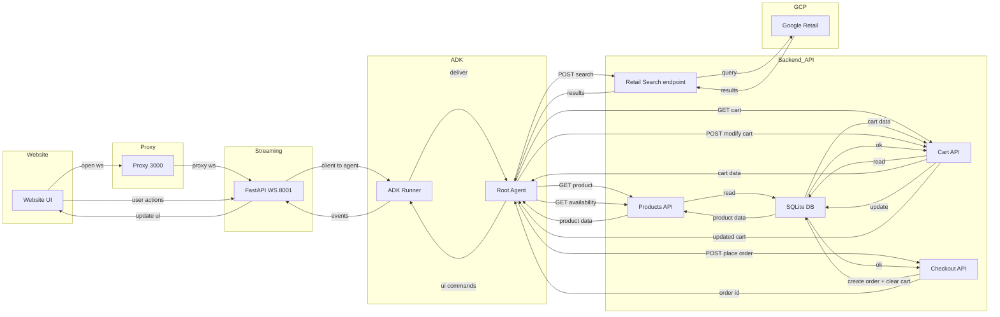
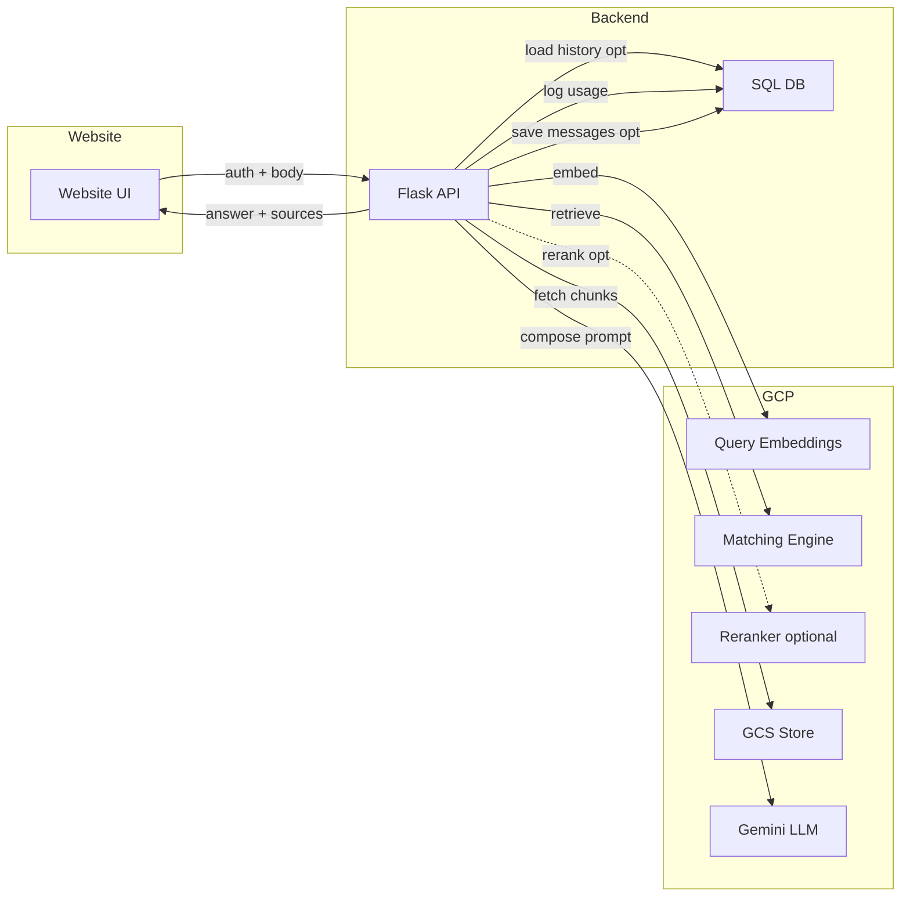

# Appendix E: Architecture diagrams and flows

Purpose: Central place to link diagrams and short captions.

- High-level system diagram: shows widget → backend API → RAG services (embeddings, retrieval, reranking) → LLM; GCS and DB on the side.
- Ingestion pipeline: discovery/crawl → clean/parse → chunk/embeddings → upsert vectors + GCS text → mapping table.
- Request flow: widget loads config → user message → RAG pipeline → answer + sources; optional SSE for status.

If you have images, place them under docs/images and link here, e.g.:
- 
- 

## Database ER diagram

Source of truth: `chatbot-backend/app/models.py`. Key entities and relationships below (field list abbreviated for readability).

```mermaid
erDiagram
	USER ||--o{ SUBSCRIPTION : "has"
	PLAN ||--o{ SUBSCRIPTION : "includes"
	USER ||--o{ CHATBOT : "owns via user_id"
	USER ||--o{ CHATBOT : "also via client_id"
	CHATBOT ||--o{ CHAT_MESSAGE : "has"
	CHAT_MESSAGE ||--o{ DETAILED_FEEDBACK : "feedback"
	CHATBOT ||--o{ VECTOR_ID_MAPPING : "maps"
	USER ||--o{ USAGE_LOG : "usage"
	CHATBOT ||--o{ USAGE_LOG : "usage"
	SUBSCRIPTION ||--o{ PAYMENT_HISTORY : "payments"

	USER {
		int id PK
		string email UNIQUE
		string client_id UNIQUE
		datetime created_at
		string password_hash
		string verification_token
		string reset_password_token
		datetime last_login
		bool is_active
		bool is_verified
		string auth_provider
		string oauth_id
		string first_name
		string last_name
		string company_name
		string phone
	}

	CHATBOT {
		int id PK
		string name
	}
	```

## Agentic chatbot: product onboarding → live agent interaction (code-grounded)

Source of truth: `agent chatbot/app.py`, `agents/customer-service/customer_service/{agent.py, tools/tools.py, config.py}`, `agents/customer-service/streaming_server.py`, `database_setup.py`, `sample_data_importer.py`, `generate_vertex_ai_jsonl.py`, and `proxy-server.js`.

Key verified details
- Product data lives in SQLite (`ecommerce.db`). Tables created by `database_setup.py`; data loaded by `sample_data_importer.py`.
- Optional: `generate_vertex_ai_jsonl.py` exports JSONL for import into Vertex AI Retail Search (used by `/api/retail/search-products`).
- Runtime services and ports: Flask API on 5000, Proxy on 3000, FastAPI streaming server on 8001.
- WebSocket path: client connects to `/ws_stream/agent_stream/{session_id}` on the Proxy; proxy rewrites to `/ws/agent_stream/{session_id}` on FastAPI.
- ADK Runner orchestrates the agent (`root_agent`), and LiveRequestQueue bridges messages; sessions are maintained in-memory.
- Tools call Flask API endpoints: cart, products, availability, retail search, checkout; responses feed back as structured UI commands.
- UI command mapping in streaming server: set_theme, display_checkout_modal, display_shipping_modal, display_payment_modal, agent_confirm_selection, order_confirmed_refresh_cart, product_recommendations payloads.

### Owner onboarding: products → searchable catalog

```mermaid
flowchart TD
	subgraph Owner
		OWN[Website owner / Operator]
	end

	subgraph LocalDB[Local Catalog]
		DB[(SQLite<br/>'ecommerce.db')]
	end

	subgraph Backend
		FLASK[Flask API<br/>(app.py :5000)]
	end

	subgraph GCP[Google Cloud]
		RETAIL[Retail Search API<br/>(Serving Config)]
	end

	subgraph Tools[Setup Scripts]
		SCHEMA[database_setup.py<br/>Create tables]
		SEED[sample_data_importer.py<br/>Insert products]
		JSONL[generate_vertex_ai_jsonl.py<br/>Export products_vertex_ai.jsonl]
	end

	OWN -->|Run once per environment| SCHEMA
	SCHEMA --> DB
	OWN -->|Load/Update catalog| SEED
	SEED --> DB
	OWN -->|Optional export| JSONL --> RETAIL

	%% Runtime usage
	FLASK -. GET /api/products, /api/products/&lt;id&gt;, /api/products/availability .-> DB
	FLASK -. POST /api/retail/search-products .-> RETAIL
```

Notes
- The Retail Search import step happens outside this repo (console/CLI); this project only produces the JSONL via `generate_vertex_ai_jsonl.py`.
- The Flask API reads from SQLite; no product creation endpoints are defined in `app.py` (owner uses scripts above).

### Live agent interaction: website ↔ proxy ↔ streaming server ↔ ADK ↔ tools ↔ backend



Notes
- WebSocket JSON from client can be either a parts array (text/image/audio) or a fallback single payload; shipping UI interactions are sent as `event_type: user_shipping_interaction` and translated to text for the agent.
- Tool outputs that are structured dicts are intercepted and converted into UI commands by `streaming_server.py` before reaching the browser.
- Order placement clears the cart in SQLite and returns a success response; the server then emits `order_confirmed_refresh_cart` to the UI.

```mermaid
erDiagram
	CHATBOT {
		int user_id FK
		string client_id FK
		string status
		datetime created_at
		datetime updated_at
		string api_key UNIQUE
		bool save_history_enabled
		bool advanced_rag_enabled
		string knowledge_adherence_level
		// ... many widget/config/index-tracking fields (see models.py)
	}

	PLAN {
		int id PK
		string name UNIQUE
		text description
		float price
		string billing_cycle
		// feature flags, limits
	}

	SUBSCRIPTION {
		int id PK
		int user_id FK
		int plan_id FK
		string status
		datetime start_date
		datetime end_date
		datetime trial_end_date
		// usage and payment tracking fields
	}

	PAYMENT_HISTORY {
		int id PK
		int subscription_id FK
		float amount
		string currency
		datetime payment_date
		string payment_method
		string transaction_id
		string status
	}

	USAGE_LOG {
		int id PK
		int user_id FK
		int chatbot_id FK
		string action_type
		text action_details
		float resource_usage
		datetime timestamp
	}

	VECTOR_ID_MAPPING {
		int id PK
		int chatbot_id FK
		string vector_id
		string source_identifier
		datetime created_at
	}

	CHAT_MESSAGE {
		int id PK
		int chatbot_id FK
		string session_id
		string role
		text content
		datetime timestamp
		string thumb_feedback
	}

	DETAILED_FEEDBACK {
		int id PK
		int message_id FK
		string session_id
		text feedback_text
		datetime timestamp
	}
```

Notes
- The `Chatbot` has dual foreign keys to `User` (`user_id` PK reference and `client_id` alternate key) used for ownership and filtering.
- `User` ↔ `Subscription` is modeled as one-to-one in ORM (uselist=False). Enforce uniqueness at the DB layer if needed.
- `ChatMessage` → `DetailedFeedback` is intended 0..1 feedback per message; add a DB unique constraint on `DetailedFeedback.message_id` to enforce strictly one.
- Full field definitions: see `chatbot-backend/app/models.py`.


## Ingestion → ready architecture (code-grounded)

Source of truth: `chatbot-backend/app/api/routes.py`, `app/services/ingestion.py`, `app/sse_utils.py`.

Key verified details
- Status updates via Redis Pub/Sub channel "chatbot-status-updates" with payload {chatbot_id, status, client_id}.
- GCS path: `gs://<bucket>/chatbot_{chatbot_id}/source_{hash}/{chunk_index}.txt`.
- Vector ID schema: `chatbot_{chatbot_id}_source_{hash}_chunk_{chunk_index}`.
- Embeddings via google.genai embed_content (task_type=RETRIEVAL_DOCUMENT); workers require GOOGLE_GENAI_USE_VERTEXAI=True to route through Vertex AI.
- Upsert to Vertex AI Matching Engine with Namespace Restriction name "chatbot_id".
- VectorIdMapping rows persisted only after successful upsert.

```mermaid
flowchart TD
	subgraph Admin
		ADM[Admin Console / Portal]
	end

	subgraph Website
		W[Customer site\nembedded widget]
	end

	subgraph Backend[Backend (Flask + Celery + Redis)]
		API[Flask API]
		RDS[(Redis)\nPub/Sub channel:\n"chatbot-status-updates"]
		WRK[Celery Worker\nrun_ingestion_task]
		DB[(SQL DB)]
	end

	subgraph GCP[Google Cloud]
		GCS[(GCS Bucket)\nchatbot_{chatbot_id}/source_{hash}/{chunk_index}.txt]
		ME[Vertex AI\nMatching Engine]
		GEN[google.genai\n(embeddings)]
	end

	%% Create chatbot (admin flow) → enqueue ingestion
	ADM -->|POST /chatbots| API
	API --> DB: Create Chatbot\nstore hashed api_key
	API --> WRK: Enqueue run_ingestion_task(chatbot_id, client_id, sources)
	API --> RDS: Publish {chatbot_id, status:"Queued", client_id}

	%% Ingestion pipeline (worker-initiated calls)
	WRK -->|chunk & hash| GCS: Save chunks
	WRK --> GEN: embed_content\n(RETRIEVAL_DOCUMENT)
	WRK --> ME: Upsert datapoints\nNamespace Restriction "chatbot_id"
	WRK --> DB: Insert VectorIdMapping\nafter successful upsert
	WRK --> RDS: Publish status transitions\n(e.g., Processing → Ready)

	%% Status streaming to website (SSE)
	W -->|GET /chatbots/status-stream?clientId=...| API
	API -. subscribes .-> RDS
	RDS -. events .-> API
	API --> W: SSE status events

	%% Ready for widget (config fetch)
	W -->|GET /chatbots/<id>/widget-config\nAuthorization: Bearer <api_key>| API
	API --> DB: Fetch widget config
	API --> W: Return config/snippet
```

Notes
- Standard RAG is the default; the "advanced" path is disabled by default due to lower effectiveness in tests.
- The SSE status stream endpoint filters messages by clientId query param on the consumer side.

## Query flow (user message → answer)

Source of truth: `chatbot-backend/app/api/routes.py` (query_chatbot), `app/services/rag_service.py`, `app/services/ranking_service.py`.

Verified steps and controls
- API key auth decorator validates hashed key and injects `g.chatbot`.
- Query embeddings via google.genai (task_type=RETRIEVAL_QUERY).
- Retrieval from Matching Engine scoped by Namespace allow_tokens=[str(chatbot_id)].
- Optional reranking via Discovery Engine RankService model "semantic-ranker-default-004" with graceful fallback to original order on error.
- Vector_id security: GCS fetch validates vector_id belongs to chatbot before read.
- Prompt enforces language mirroring and knowledge adherence; Gemini GenerativeModel produces the answer.
- Telemetry logged to UsageLog: finish_reason, safety_ratings, token counts.
 - Chat history: load recent messages if enabled; after response, save user and assistant messages when history is enabled.



