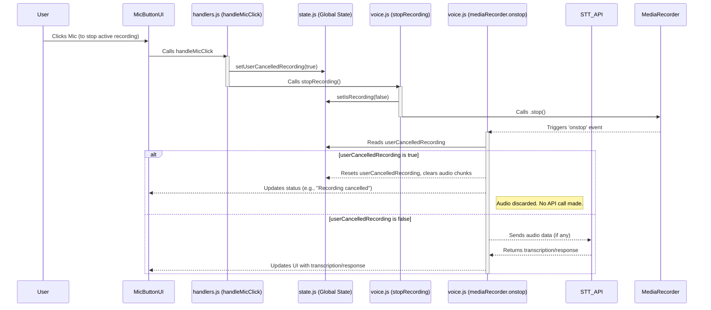

# Plan: Robust "Stop Active Recording" for Chatbot Widget

**Date:** 2025-05-09

**Objective:** To implement robust and universal cancellation functionality in the `chatbot-widget`, starting with perfecting the "stop active recording" feature. This plan details the modifications required, using `chatbot-frontend/src/pages/ChatPage.jsx` as a reference for correct implementation patterns.

## 1. Key Observations

*   **Widget's Strength**: The `chatbot-widget/src/voice.js` already possesses a `state.userCancelledRecording` flag. Its `mediaRecorder.onstop` handler correctly checks this flag. If `state.userCancelledRecording` is `true`, it discards the audio, resets the flag, and updates the UI, thereby preventing any STT API call. This forms a solid foundation.
*   **Widget's Gap**: The primary gap is that when a user clicks the mic button to halt an ongoing recording, the `handleMicClick` function in `chatbot-widget/src/handlers.js` invokes `stopRecording()` but does not explicitly set `state.userCancelledRecording` to `true`.
*   **`ChatPage.jsx` Reference Insights**:
    *   Its `handleMicButtonClick` function calls `stopRecording(true)`, passing a `manualStop` flag.
    *   The `stopRecording(manualStop = false)` function in `ChatPage.jsx` utilizes this flag to, among other actions, abort any ongoing voice API request if `manualStop` is true.
    *   The `mediaRecorder.onstop` in `ChatPage.jsx` primarily verifies if audio data exists (`hasAudioData`) before processing, rather than relying on a specific user cancellation flag at that juncture (cancellation is handled more proactively in its `stopRecording` method).

## 2. Proposed Modifications for `chatbot-widget`

The main goal is to ensure that when the user clicks the microphone icon to stop an active recording, the audio is discarded and not sent for transcription. We will leverage and correctly set the existing `state.userCancelledRecording` mechanism in the widget.

### 2.1. Modify `chatbot-widget/src/handlers.js` - `handleMicClick()`

*   **Context**: When `isRecording` is `true` (indicating the user is clicking to stop an active recording).
*   **Action**: Set `state.setUserCancelledRecording(true);` *before* calling `stopRecording()`.
*   **Reasoning**: This ensures that when `stopRecording()` is called and subsequently triggers the `mediaRecorder.onstop` event, the `onstop` handler will find `userCancelledRecording` as true and will correctly discard the audio.

    **Current Code Snippet (Illustrative):**
    ```javascript
    // export function handleMicClick() {
    //     if (isRecording) {
    //         stopRecording();
    //     } else {
    //         startRecording();
    //     }
    // }
    ```

    **Proposed Change:**
    ```javascript
    export function handleMicClick() {
        if (isRecording) { // Use direct isRecording state
            state.setUserCancelledRecording(true); // <<<--- ADD THIS LINE
            stopRecording(); // Use function from voice module directly
        } else {
            startRecording(); // Use function from voice module directly
        }
    }
    ```

### 2.2. Review `chatbot-widget/src/voice.js` - `stopRecording()`

*   This function already correctly calls `state.mediaRecorder.stop()`, which is responsible for triggering the `onstop` event.
*   It also sets `state.setIsRecording(false)` early, which is beneficial for UI responsiveness.
*   **No direct changes are anticipated for this function regarding the cancellation logic itself**, as the primary handling of `userCancelledRecording` is correctly located within the `mediaRecorder.onstop` handler.

### 2.3. Confirm `chatbot-widget/src/voice.js` - `mediaRecorder.onstop` handler (within `startRecording`)

*   The existing code block for handling user cancellation is:
    ```javascript
    // Inside newMediaRecorder.onstop = async () => { ... }
    if (state.userCancelledRecording) {
        console.log("[voice:onstop] Recording was cancelled by user. Discarding audio.");
        state.setLocalAudioChunks([]); // Clear any potentially recorded chunks
        state.setUserCancelledRecording(false); // Reset the flag
        ui.updateVoiceStatus('Recording cancelled.');
        // Ensure STT loading is false if it was somehow set
        if (state.sttLoading) state.setSttLoading(false);
        ui.updateInputDisabledState(); // Re-enable inputs
        return; // Exit early, do not process audio
    }
    ```
*   This logic is already robust and correctly handles the scenario where `userCancelledRecording` is true. It will discard audio, reset the flag, and update the UI appropriately. **No changes are needed here.**

## 3. Logging

As per global instructions, extensive logging will be added to the modified `handleMicClick` function and relevant parts of `stopRecording` and `mediaRecorder.onstop` during the implementation phase. This will help trace the cancellation flow and debug any potential issues.

## 4. Flow Diagram: Stop Recording Path



This plan focuses on a minimal, targeted change to correctly set the `userCancelledRecording` flag, leveraging the widget's existing robust logic in `mediaRecorder.onstop` to achieve the desired "stop active recording" behavior.