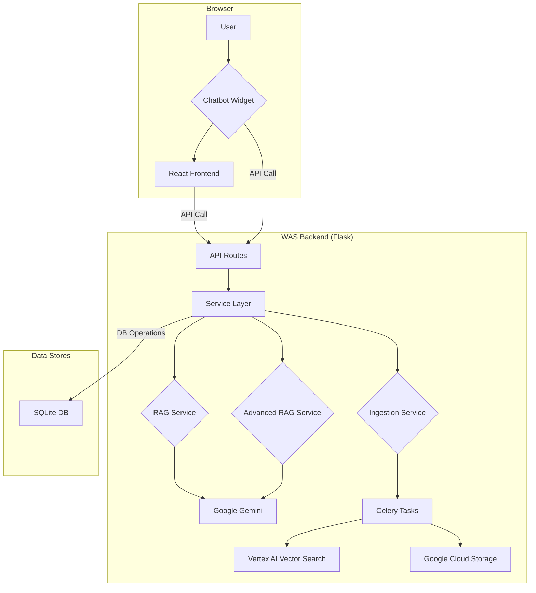
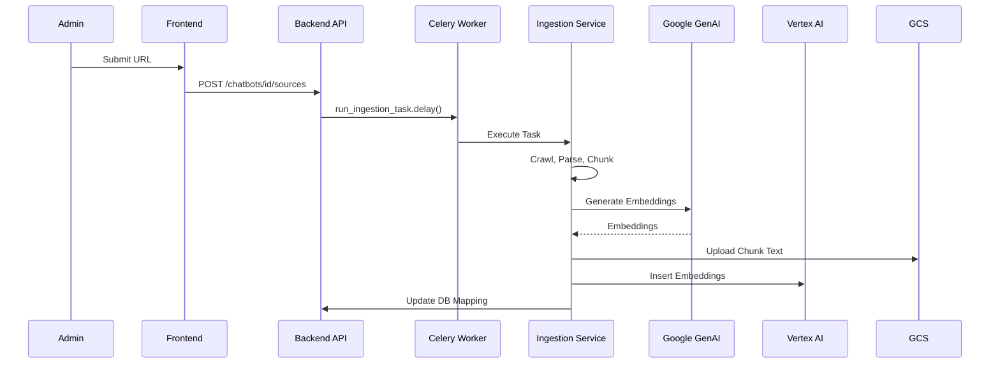
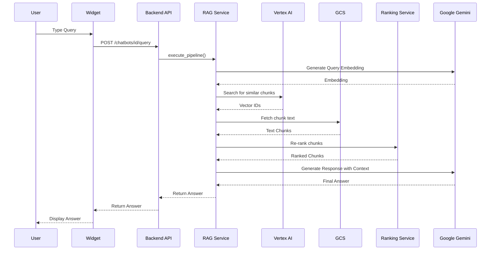

## 6. The Implementation

This section details the practical implementation of the projects, focusing on the software architecture, the roles of the main components, the flow of key algorithms, and the structure of the database.

### 6.1 Website AI Assistant (WAS) Implementation

The WAS platform is implemented as a three-tier application, with a clear separation between the backend, frontend, and the embeddable widget.

#### 6.1.1 Architecture and Main Components

The system's architecture is realized through three distinct but interconnected codebases:

*   **Backend (`chatbot-backend`):**
    *   **Core Application:** Built using the **Flask** web framework. The main application is initialized in `app/__init__.py`, where extensions like the database (Flask-SQLAlchemy) and login manager are configured.
    *   **API Endpoints (`app/api/routes.py`):** This file defines all the HTTP endpoints that the frontend and widget communicate with. It handles request validation, authentication, and orchestrates calls to the service layer. Key endpoints include `/chatbots` for creation and listing, `/chatbots/<id>` for management, and `/chatbots/<id>/query` for the core RAG functionality.
    *   **Service Layer (`app/services/`):** This is where the core business logic resides.
        *   `rag_service.py`: The heart of the application. The `RagService` class manages the entire RAG pipeline, including initializing clients for Google Cloud services, generating embeddings, retrieving chunks from the vector index, constructing prompts, and generating the final response from the LLM.
        *   `ingestion_service.py`: Handles the logic for processing data sources. It contains functions for crawling websites and parsing different file types (PDF, DOCX).
        *   `advanced_rag_service.py`: Implements the optional, more complex RAG pipeline, including steps for query decomposition and re-ranking.
    *   **Asynchronous Tasks (`app/tasks/`):** To avoid blocking the API with long-running operations, the system uses **Celery**.
        *   `ingestion_tasks.py`: Contains the Celery task that performs the actual data ingestion and embedding process in the background.
        *   `deletion_tasks.py`: Contains Celery tasks for asynchronously deleting chatbot data from the vector index and database.
    *   **Database Models (`app/models.py`):** Defines the application's database schema using SQLAlchemy's ORM.

*   **Frontend (`chatbot-frontend`):**
    *   **Core Application:** A **React** Single-Page Application (SPA), with `src/main.jsx` as the entry point.
    *   **Routing:** `react-router-dom` is used to manage navigation between different pages (e.g., Login, Dashboard, Edit Chatbot).
    *   **Components (`src/components/`):** The UI is built from a collection of reusable React components, such as forms for adding data sources (`AddUrlForm.jsx`) and settings for widget customization (`WidgetCustomizationSettings.jsx`).
    *   **Pages (`src/pages/`):** These components represent the main views of the application, such as `DashboardPage.jsx` and `EditChatbotPage.jsx`.
    *   **API Communication (`src/services/api.js`):** An Axios-based service that centralizes all HTTP requests to the backend API.

*   **Widget (`chatbot-widget`):**
    *   **Core Logic (`src/index.js`):** The main entry point for the widget. It handles initialization, reads configuration from the `data-` attributes on the script tag, and sets up event listeners.
    *   **UI Management (`src/ui.js`):** Contains the functions responsible for creating, showing, hiding, and updating the HTML elements of the chat widget.
    *   **State Management (`src/state.js`):** A simple, custom state management module to hold the conversation history and UI state.
    *   **Event Handling (`src/handlers.js`):** Manages user interactions, such as sending a message, clicking the voice input button, or canceling a request.



#### 6.1.2 Core Algorithms and Data Flow

*   **Data Ingestion and Indexing:**
    1.  An administrator submits a new data source (e.g., a URL) via the frontend dashboard.
    2.  The request hits the `/chatbots/<id>/sources` endpoint in `routes.py`.
    3.  The route validates the request and queues an asynchronous task by calling `run_ingestion_task.delay()`.
    4.  A Celery worker picks up the task and executes the logic in `ingestion_service.py`.
    5.  The service crawls the URL or parses the file, extracts the text, and splits it into chunks.
    6.  For each chunk, it generates a vector embedding using the Google GenAI API.
    7.  The chunk text is uploaded to Google Cloud Storage, and the vector embedding is inserted into the Vertex AI Vector Search index, namespaced by the `chatbot_id`.
    8.  A mapping between the vector ID and the source identifier is saved in the `VectorIdMapping` table in the database.



*   **RAG Query Processing:**
    1.  An end-user types a query into the widget.
    2.  The widget's `handlers.js` sends the query to the `/chatbots/<id>/query` endpoint, including the chatbot's API key.
    3.  The `@require_api_key` decorator in `routes.py` validates the key.
    4.  The route calls the `execute_pipeline` method in the `RagService`.
    5.  The service generates an embedding for the user's query.
    6.  It calls the `retrieve_chunks_multi_query` method, which queries the Vertex AI Vector Search index, filtering by the `chatbot_id` namespace to find the most relevant vector IDs.
    7.  The service then fetches the corresponding text for these vector IDs from Google Cloud Storage using the `fetch_chunk_texts` method.
    8.  The retrieved texts are passed to the `RankingService` to be re-ranked for relevance.
    9.  The service constructs a detailed prompt containing the user's query and the re-ranked context, using the `construct_prompt` method.
    10. This final prompt is sent to the Google Gemini model via the `generate_response` method.
    11. The generated answer is returned through the API to the widget, which then displays it to the user.



#### 6.1.3 Database Implementation

The application's data is stored in a **SQLite** database, managed by **Flask-SQLAlchemy**. The schema, defined in `app/models.py`, consists of several key tables:

*   **`User`:** Stores information about the administrators, including their email, a unique `client_id`, and authentication details. Each user can own multiple chatbots.
*   **`Chatbot`:** The central table, containing the configuration for each chatbot. This includes its name, owner (`user_id`), status, and a wide range of customization settings for the widget's appearance and features (e.g., `widget_primary_color`, `voice_enabled`, `advanced_rag_enabled`).
*   **`VectorIdMapping`:** A crucial table for the RAG process. It creates a link between a `chatbot_id`, a `vector_id` in the Vertex AI index, and the `source_identifier` (e.g., the URL or filename) where the original text came from.
*   **`ChatMessage`:** Stores the history of conversations for each chatbot, linked by a `session_id`. Each row represents a single message from either the 'user' or the 'assistant'.
*   **`Plan`, `Subscription`, `PaymentHistory`, `UsageLog`:** A set of tables designed to support a subscription-based service model, tracking different plans, user subscriptions, payments, and usage.

### 6.2 Agentic Chatbot Implementation

The agentic chatbot is not a standalone application in the same way as WAS, but rather a proof-of-concept implemented within the **Google Agent Development Kit (ADK)** framework.

*   **Main Components:**
    *   **Agent Definition (`customer_service/`):** The core logic is defined within this directory. The agent's capabilities are determined by the set of "tools" it is given.
    *   **Tools (`customer_service/tools/tools.py`):** This file (inferred location) contains the Python functions that the agent can call. In this implementation, these are **mocked functions** that simulate interactions with external systems. For example, the `modify_cart` function does not connect to a real e-commerce backend; it simply returns a success message to demonstrate the agent's reasoning capability.
*   **Algorithm:**
    1.  The user provides input via the ADK's command-line or web interface.
    2.  The ADK framework sends the user's input, the conversation history, and the list of available tools to the Gemini LLM.
    3.  The LLM acts as a reasoning engine. It analyzes the user's intent and determines if one of the tools can help fulfill the request.
    4.  If it chooses a tool, it also extracts the necessary parameters from the conversation.
    5.  The ADK executes the chosen Python function with the extracted parameters.
    6.  The return value of the function (the "tool output") is sent back to the LLM.
    7.  The LLM then uses the tool's output to generate a natural language response for the user.
*   **Database:** This project uses a simple **SQLite** database (`ecommerce.db`) for the mocked product catalog, but it is not integrated into the agent's core logic in the same way as the WAS platform's database. The agent's interaction with it is simulated through the tool functions.

```mermaid
sequenceDiagram
    participant User
    participant ADK as ADK Framework
    participant Gemini as Gemini LLM (Reasoning Engine)
    participant Tools as Python Functions (e.g., modify_cart)

    User->>ADK: "Add a product to my cart"
    ADK->>Gemini: send_request(prompt, tools, history)
    note right of Gemini: LLM analyzes user intent and available tools.
    Gemini-->>ADK: response(tool_code = "modify_cart(product='xyz')")
    note left of ADK: ADK parses the response and sees a tool call.
    ADK->>Tools: execute(modify_cart(product='xyz'))
    Tools-->>ADK: return "Success"
    ADK->>Gemini: send_request(prompt, tools, history, tool_output="Success")
    note right of Gemini: LLM receives tool output and formulates a user-facing response.
    Gemini-->>ADK: response(text="I've added product 'xyz' to your cart.")
    ADK->>User: "I've added product 'xyz' to your cart."